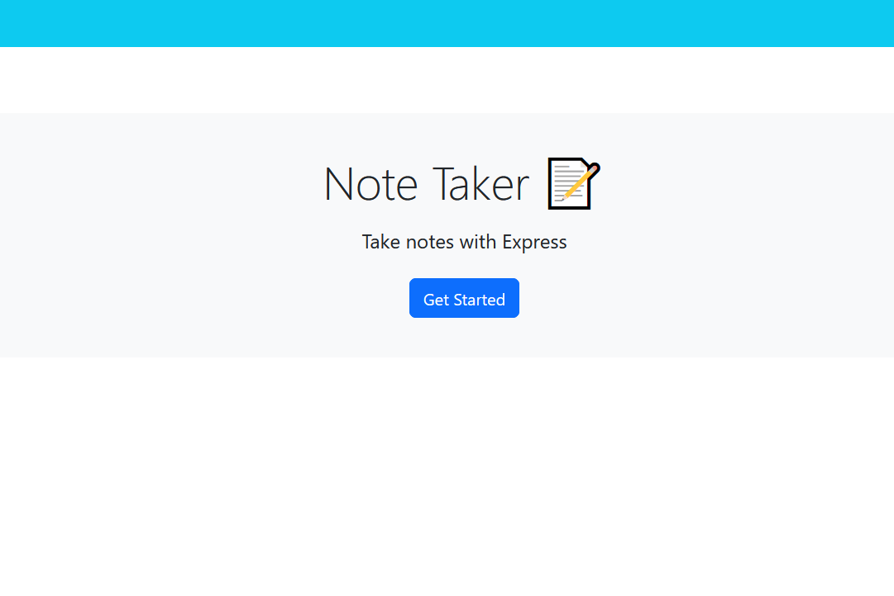
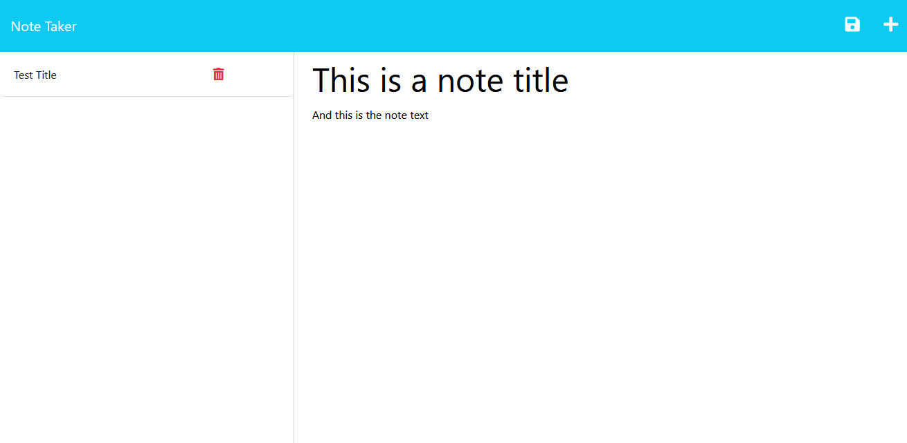

# Challenge 11 Note Taker

### Week 6 DU bootcamp challenge

### License

MIT

### Description

The challenge: fixing starter code to link the two pages and enable the save button to create notes.

### Usage

Click the button to get started, then type in your note title and text and click the save button in the top right corner. To create a new note, click the + button.

### Links

Heroku: https://fast-chamber-96948.herokuapp.com/

